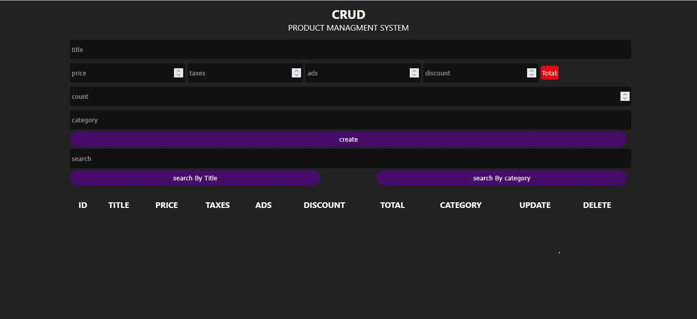

# JavaScript CRUD Product Management System

A responsive Product Management System built with HTML5, CSS3, and Vanilla JavaScript.

This project demonstrates the core CRUD operations used in modern web applications to create, manage, search, update, and delete product data.

---

## 🚀 Live Demo

🔗 [View Live Demo](https://javascript-crud-jkjc9r7by-mohamedelsaid.vercel.app/)

## 📸 Project Preview



---

## ✨ Features

- Create new products
- Automatically calculate product totals
- Add multiple products using the count field
- Update existing products
- Delete individual products
- Delete all products
- Search products by title
- Search products by category
- Product data management using JavaScript
- Responsive user interface
- Data stored using Local Storage

---

## 🛠️ Technologies

- HTML5
- CSS3
- JavaScript (ES6+)
- DOM Manipulation
- Local Storage
- Responsive Web Design

---

## 📂 Project Structure

```text
javascript-crud-app/
│
├── crud.html
├── main.js
├── style.css
├── screenshot.png
└── README.md
